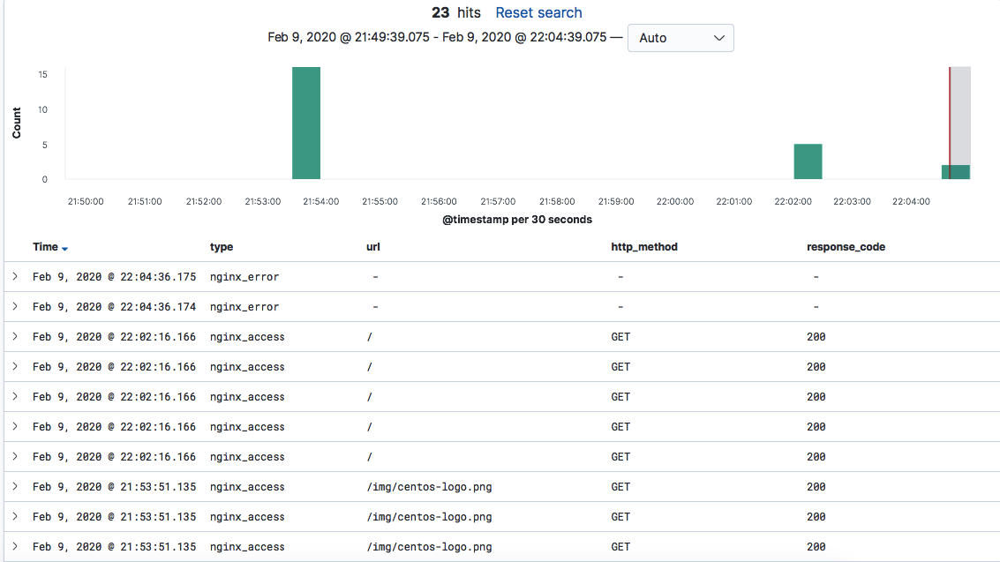

# Сбор и анализ логов

## TO-DO

- [х] Основное задание
- [х] Задание со *

## Домашнее задание

>Настраиваем центральный сервер для сбора логов в вагранте поднимаем 2 машины web и log. На web поднимаем nginx на log настраиваем центральный лог сервер на любой системе на выбор
>
>- journald
>- rsyslog
>- elk
>настраиваем аудит следящий за изменением конфигов нжинкса
>- Все критичные логи с web должны собираться и локально и удаленно
>- Все логи с nginx должны уходить на удаленный сервер (локально только критичные)
>- Логи аудита должны также уходить на удаленную систему
> Задание со * развернуть еще машину elk
>и таким образом настроить 2 центральных лог системы elk И какую либо еще
>в elk должны уходить только логи нжинкса
>во вторую систему все остальное
>Критерии оценки: 4 - если присылают только логи скриншоты без вагранта
>5 - за полную настройку
>6 - если выполнено задание со звездочкой

---

Система логирования и web сервер были подняты на Яндекс Cloud.

- Elasticsearch, logstash, kibana - <http://84.201.156.34:5601>
- Nginx,Filebeat,Rsyslog client - 84.201.172.8
- Rsyslog server - 84.201.157.235

На серверах настроен logrotate
Логи с nginx разделены по типа - access и error, поступают на ELK. Убедиться в этом можно, перейдя по ссылке web сервера Nginx <http://84.201.172.8> , после проверить совершенные действия в Kibana <http://84.201.156.34:5601>

Все системные логи с машины Nginx собираются на отдельной машине для rsyslog

