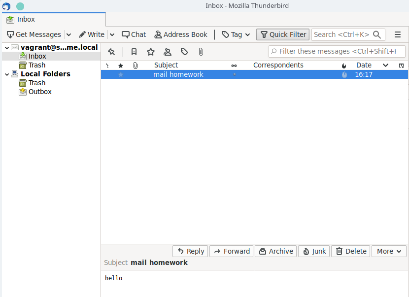

# Почта: SMTP, IMAP, POP3

## Домашнее задание

Установка почтового сервера

1. Установить в виртуалке postfix+dovecot для приёма почты на виртуальный домен любым обсужденным на семинаре способом
2. Отправить почту телнетом с хоста на виртуалку
3. Принять почту на хост почтовым клиентом

Результат

1. Полученное письмо со всеми заголовками
2. Конфиги postfix и dovecot

## Выполнение

1. Для проверки, выполняем:

```bash
vagrant up
```

2. Отправляем почту по telnet с localhost:

```bash
telnet localhost 8025

ehlo server.home.local
mail from: user@otus.ru
rcpt to: vagrant@server.home.local
data
Subject: mail homework
hello
.
```

3. Проверяем почту telnet'ом:

```bash
telnet localhost 8143

a login vagrant password
b select inbox
```

4. Проверяем почту с помощью почтового клиента Thunderbird:

В настройках указываем адрес: **vagrant@server.home.local**, пароль **password**:

- IMAP - server hostname localhost, port 8143 SSL none, Authentication normal password
- SMTP - server hostname localhost, port 8025 SSL none, Authentication normal password

