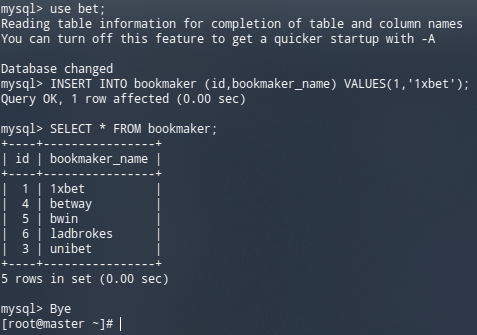
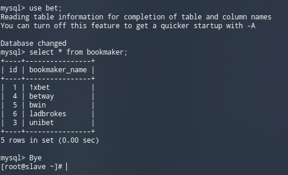

# MySQL

## Домашнее задание

Развернуть базу из дампа и настроить репликацию. В материалах приложены ссылки на вагрант для репликации и дамп базы bet.dmp.Базу развернуть на мастере и настроить чтобы реплицировались таблицы
| bookmaker |
| competition |
| market |
| odds |
| outcome

Задание с * Настроить GTID репликацию

Варианты которые принимаются к сдаче
- рабочий вагрантафайл
- скрины или логи SHOW TABLES
Задание с * конфиги, пример в логе изменения строки и появления строки на реплике

## Выполнение

1. Поднимаем vagrant

```bash
vagrant up
```

2. После запускаем playbook:

```bash
ansible-playbook provision.yml
```

3. Стенд готов. Для проверки можно зайти на slave машину и посмотреть статус репликации:


4. Заинсертим значение из методички на master машине:



5. Проверим прошла ли реплика на slave машине:



Все работает.