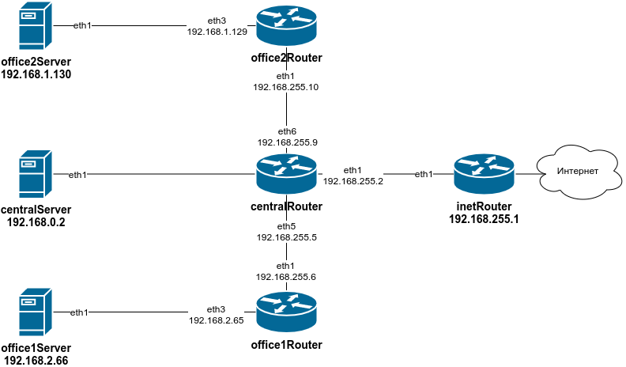

# Архитектура сетей

## Домашнее задание

Hазворачиваем сетевую лабораторию.

Vagrantfile с начальным построением сети:

- inetRouter
- centralRouter
- centralServer

Теоретическая часть.

- Найти свободные подсети
- Посчитать сколько узлов в каждой подсети, включая свободные
- Указать broadcast адрес для каждой подсети
- Проверить нет ли ошибок при разбиении

Практическая часть.

Соединить офисы в сеть согласно схеме и настроить роутинг:

- Все сервера и роутеры должны ходить в инет черз inetRouter
- Все сервера должны видеть друг друга
- У всех новых серверов отключить дефолт на нат (eth0), который вагрант поднимает для связи
- При нехватке сетевых интервейсов добавить по несколько адресов на интерфейс

Построить следующую архитектуру

Сеть office1:

- 192.168.2.0/26 - dev
- 192.168.2.64/26 - test servers
- 192.168.2.128/26 - managers
- 192.168.2.192/26 - office hardware

Сеть office2:

- 192.168.1.0/25 - dev
- 192.168.1.128/26 - test servers
- 192.168.1.192/26 - office hardware

### Выполнение

**Сеть office1**

| Наименование    | Сеть            | Маска           | Broadcast     | Хосты  |
|-----------------|------------------|-----------------|---------------|-------|
| dev             | 192.168.2.0/26   | 255.255.255.192 | 192.168.2.63  | 62    |
| test servers    | 192.168.2.64/26  | 255.255.255.192 | 192.168.2.127 | 62    |
| managers        | 192.168.2.128/26 | 255.255.255.192 | 192.168.2.191 | 62    |
| office hardware | 192.168.2.192/26 | 255.255.255.192 | 192.168.2.255 | 62    |

**Сеть office2**

| Наименование    | Сеть            | Маска           | Broadcast     | Хосты  |
|-----------------|------------------|-----------------|---------------|-------|
| dev             | 192.168.1.0/25   | 255.255.255.128 | 192.168.1.127 | 126   |
| test servers    | 192.168.1.128/26 | 255.255.255.192 | 192.168.1.191 | 62    |
| office hardware | 192.168.1.192/26 | 255.255.255.192 | 192.168.1.254 | 62    |

**Сеть central**

| Наименование    | Сеть            | Маска           | Broadcast     | Хосты |
|-----------------|-----------------|-----------------|---------------|-------|
| directors       | 192.168.0.0/28  | 255.255.255.240 | 192.168.0.15  | 14    |
| сводобная сеть  | 192.168.0.16/28 | 255.255.255.240 | 192.168.0.31  | 14    |
| office hardware | 192.168.0.32/28 | 255.255.255.240 | 192.168.0.47  | 14    |
| wifi            | 192.168.0.64/26 | 255.255.255.192 | 192.168.0.127 | 62    |
| свободная сеть  | 192.168.0.128/25| 255.255.255.128 | 192.168.0.255 | 128   |

Не очень понял, что конкретно надо проверить в пункте - *Проверить нет ли ошибок при разбиении*, на мой взгляд все в порядке.

Схема сети представлена ниже.

