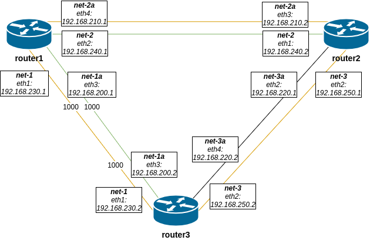

# Статическая и динамическая маршрутизация

## Домашнее задание

OSPF
- Поднять три виртуалки
- Объединить их разными private network
1. Поднять OSPF между машинами средствами программных маршрутизаторов на выбор: Quagga, FRR или BIRD
2. Изобразить ассиметричный роутинг
3. Сделать один из линков "дорогим", но что бы при этом роутинг был симметричным

Формат сдачи:
Vagrantfile + ansible

## Выполнение

В качестве программного роутера было выбрано решение Quagga. Посмотрел на FRR, в принципе тоже неплох, но вероятно были какие-то проблемы с серверами и загрузка rpm-ника шла по 10-15 минут на каждой машине, что не есть быстро. Вернулся на Quagga.

Схема стенда:



1. Поднимаем стенд:

```bash
vagrant up
```

2. Провиженим:

```bash
ansible-playbook provision.yml -vv
```

Информация о маршрутах на роутерах:

```bash
[vagrant@router1 ~]$ ip r
default via 10.0.2.2 dev eth0 proto dhcp metric 100 
10.0.2.0/24 dev eth0 proto kernel scope link src 10.0.2.15 metric 100 
192.168.200.0/29 dev eth3 proto kernel scope link src 192.168.200.1 metric 103 
192.168.210.0/29 dev eth4 proto kernel scope link src 192.168.210.1 metric 104 
192.168.220.0/29 proto zebra metric 20 
        nexthop via 192.168.240.2 dev eth2 weight 1 
        nexthop via 192.168.210.2 dev eth4 weight 1 
192.168.230.0/29 dev eth1 proto kernel scope link src 192.168.230.1 metric 101 
192.168.240.0/29 dev eth2 proto kernel scope link src 192.168.240.1 metric 102 
192.168.250.0/29 proto zebra metric 20 
        nexthop via 192.168.240.2 dev eth2 weight 1 
        nexthop via 192.168.210.2 dev eth4 weight 1 
```

```bash
[vagrant@router2 ~]$ ip r
default via 10.0.2.2 dev eth0 proto dhcp metric 101 
10.0.2.0/24 dev eth0 proto kernel scope link src 10.0.2.15 metric 101 
192.168.200.0/29 proto zebra metric 20 
        nexthop via 192.168.250.2 dev eth2 weight 1 
        nexthop via 192.168.220.2 dev eth4 weight 1 
192.168.210.0/29 dev eth3 proto kernel scope link src 192.168.210.2 metric 103 
192.168.220.0/29 dev eth4 proto kernel scope link src 192.168.220.1 metric 104 
192.168.230.0/29 proto zebra metric 1010 
        nexthop via 192.168.240.1 dev eth1 weight 1 
        nexthop via 192.168.210.1 dev eth3 weight 1 
        nexthop via 192.168.250.2 dev eth2 weight 1 
        nexthop via 192.168.220.2 dev eth4 weight 1 
192.168.240.0/29 dev eth1 proto kernel scope link src 192.168.240.2 metric 100 
192.168.250.0/29 dev eth2 proto kernel scope link src 192.168.250.1 metric 102
```

```bash
[vagrant@router3 ~]$ ip r
default via 10.0.2.2 dev eth0 proto dhcp metric 101 
10.0.2.0/24 dev eth0 proto kernel scope link src 10.0.2.15 metric 101 
192.168.200.0/29 dev eth3 proto kernel scope link src 192.168.200.2 metric 103 
192.168.210.0/29 proto zebra metric 20 
        nexthop via 192.168.250.1 dev eth2 weight 1 
        nexthop via 192.168.220.1 dev eth4 weight 1 
        nexthop via 192.168.200.1 dev eth3 weight 1 
192.168.220.0/29 dev eth4 proto kernel scope link src 192.168.220.2 metric 104 
192.168.230.0/29 dev eth1 proto kernel scope link src 192.168.230.2 metric 100 
192.168.240.0/29 proto zebra metric 20 
        nexthop via 192.168.250.1 dev eth2 weight 1 
        nexthop via 192.168.220.1 dev eth4 weight 1 
        nexthop via 192.168.200.1 dev eth3 weight 1 
192.168.250.0/29 dev eth2 proto kernel scope link src 192.168.250.2 metric 102 
```

3. Смотрим **tracepath** между router3 и router1, должен быть выбрать "дешевый" маршрут.

```bash
[vagrant@router3 ~]$ tracepath -n 192.168.210.1
 1?: [LOCALHOST]                                         pmtu 1500
 1:  192.168.250.1                                         1.240ms 
 1:  192.168.250.1                                         0.907ms 
 2:  192.168.210.1                                         1.858ms reached
     Resume: pmtu 1500 hops 2 back 2 
```

```bash
[vagrant@router3 ~]$ tracepath -n 192.168.240.1
 1?: [LOCALHOST]                                         pmtu 1500
 1:  192.168.220.1                                         1.310ms 
 1:  192.168.220.1                                         0.955ms 
 2:  192.168.240.1                                         1.942ms reached
     Resume: pmtu 1500 hops 2 back 2 
```

Проверим как пойдет от router1 к router3:

```bash
[vagrant@router1 ~]$ tracepath -n 192.168.250.2
 1?: [LOCALHOST]                                         pmtu 1500
 1:  192.168.210.2                                         1.448ms 
 1:  192.168.210.2                                         1.016ms 
 2:  192.168.250.2                                         2.134ms reached
     Resume: pmtu 1500 hops 2 back 2 
```

Ospf cost работает.

4. Проверим асинхронную маршрутизацию, трафик отправляем с одного интерфейса, получаем на другом.

Не взлетает почему-то ?! трафик как уходит с одного интерфейса так и приходит. Пингую router3