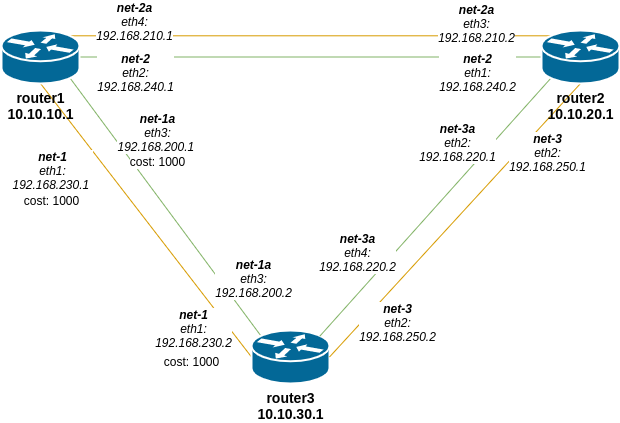

# Статическая и динамическая маршрутизация

## Домашнее задание

OSPF
- Поднять три виртуалки
- Объединить их разными private network
1. Поднять OSPF между машинами средствами программных маршрутизаторов на выбор: Quagga, FRR или BIRD
2. Изобразить ассиметричный роутинг
3. Сделать один из линков "дорогим", но что бы при этом роутинг был симметричным

Формат сдачи:
Vagrantfile + ansible

## Выполнение

В качестве программного роутера было выбрано решение Quagga. Посмотрел на FRR, в принципе тоже неплох, но вероятно были какие-то проблемы с серверами и загрузка rpm-ника шла по 10-15 минут на каждой машине, что не есть быстро. Вернулся на Quagga.

Схема стенда:



1. Поднимаем стенд:

```bash
vagrant up
```

2. Провиженим:

```bash
ansible-playbook provision.yml -vv
```

Информация о маршрутах на роутерах:

```bash
[root@router1 ~] ip r
default via 10.0.2.2 dev eth0 proto dhcp metric 100 
10.0.2.0/24 dev eth0 proto kernel scope link src 10.0.2.15 metric 100 
10.10.10.0/29 dev eth5 proto kernel scope link src 10.10.10.1 metric 105 
10.10.20.0/29 proto zebra metric 20 
        nexthop via 192.168.240.2 dev eth2 weight 1 
        nexthop via 192.168.210.2 dev eth4 weight 1 
10.10.30.0/29 proto zebra metric 30 
        nexthop via 192.168.240.2 dev eth2 weight 1 
        nexthop via 192.168.210.2 dev eth4 weight 1 
192.168.200.0/29 dev eth3 proto kernel scope link src 192.168.200.1 metric 103 
192.168.210.0/29 dev eth4 proto kernel scope link src 192.168.210.1 metric 104 
192.168.220.0/29 proto zebra metric 20 
        nexthop via 192.168.240.2 dev eth2 weight 1 
        nexthop via 192.168.210.2 dev eth4 weight 1 
192.168.230.0/29 dev eth1 proto kernel scope link src 192.168.230.1 metric 101 
192.168.240.0/29 dev eth2 proto kernel scope link src 192.168.240.1 metric 102 
192.168.250.0/29 proto zebra metric 20 
        nexthop via 192.168.240.2 dev eth2 weight 1 
        nexthop via 192.168.210.2 dev eth4 weight 1 
```

```bash
[root@router2 ~] ip r
default via 10.0.2.2 dev eth0 proto dhcp metric 100 
10.0.2.0/24 dev eth0 proto kernel scope link src 10.0.2.15 metric 100 
10.10.10.0/29 proto zebra metric 20 
        nexthop via 192.168.240.1 dev eth1 weight 1 
        nexthop via 192.168.210.1 dev eth3 weight 1 
10.10.20.0/29 dev eth5 proto kernel scope link src 10.10.20.1 metric 105 
10.10.30.0/29 proto zebra metric 20 
        nexthop via 192.168.250.2 dev eth2 weight 1 
        nexthop via 192.168.220.2 dev eth4 weight 1 
192.168.200.0/29 proto zebra metric 20 
        nexthop via 192.168.250.2 dev eth2 weight 1 
        nexthop via 192.168.220.2 dev eth4 weight 1 
192.168.210.0/29 dev eth3 proto kernel scope link src 192.168.210.2 metric 103 
192.168.220.0/29 dev eth4 proto kernel scope link src 192.168.220.1 metric 104 
192.168.230.0/29 proto zebra metric 1010 
        nexthop via 192.168.240.1 dev eth1 weight 1 
        nexthop via 192.168.210.1 dev eth3 weight 1 
        nexthop via 192.168.250.2 dev eth2 weight 1 
        nexthop via 192.168.220.2 dev eth4 weight 1 
192.168.240.0/29 dev eth1 proto kernel scope link src 192.168.240.2 metric 101 
192.168.250.0/29 dev eth2 proto kernel scope link src 192.168.250.1 metric 102 
```

```bash
[root@router3 ~] ip r
default via 10.0.2.2 dev eth0 proto dhcp metric 100 
10.0.2.0/24 dev eth0 proto kernel scope link src 10.0.2.15 metric 100 
10.10.10.0/29 via 192.168.200.1 dev eth3 proto zebra metric 20 
10.10.20.0/29 proto zebra metric 20 
        nexthop via 192.168.250.1 dev eth2 weight 1 
        nexthop via 192.168.220.1 dev eth4 weight 1 
10.10.30.0/29 dev eth5 proto kernel scope link src 10.10.30.1 metric 105 
192.168.200.0/29 dev eth3 proto kernel scope link src 192.168.200.2 metric 103 
192.168.210.0/29 proto zebra metric 20 
        nexthop via 192.168.250.1 dev eth2 weight 1 
        nexthop via 192.168.220.1 dev eth4 weight 1 
        nexthop via 192.168.200.1 dev eth3 weight 1 
192.168.220.0/29 dev eth4 proto kernel scope link src 192.168.220.2 metric 104 
192.168.230.0/29 dev eth1 proto kernel scope link src 192.168.230.2 metric 101 
192.168.240.0/29 proto zebra metric 20 
        nexthop via 192.168.250.1 dev eth2 weight 1 
        nexthop via 192.168.220.1 dev eth4 weight 1 
        nexthop via 192.168.200.1 dev eth3 weight 1 
192.168.250.0/29 dev eth2 proto kernel scope link src 192.168.250.2 metric 102 
```

3. Смотрим **tracepath** между router3 и router1, должен быть выбрать "дешевый" маршрут.

```bash
[vagrant@router3 ~]$ tracepath -n 192.168.210.1
 1?: [LOCALHOST]                                         pmtu 1500
 1:  192.168.250.1                                         1.240ms 
 1:  192.168.250.1                                         0.907ms 
 2:  192.168.210.1                                         1.858ms reached
     Resume: pmtu 1500 hops 2 back 2 
```

```bash
[vagrant@router3 ~]$ tracepath -n 192.168.240.1
 1?: [LOCALHOST]                                         pmtu 1500
 1:  192.168.220.1                                         1.310ms 
 1:  192.168.220.1                                         0.955ms 
 2:  192.168.240.1                                         1.942ms reached
     Resume: pmtu 1500 hops 2 back 2 
```

Проверим как пойдет от router1 к router3:

```bash
[vagrant@router1 ~]$ tracepath -n 192.168.250.2
 1?: [LOCALHOST]                                         pmtu 1500
 1:  192.168.210.2                                         1.448ms 
 1:  192.168.210.2                                         1.016ms 
 2:  192.168.250.2                                         2.134ms reached
     Resume: pmtu 1500 hops 2 back 2 
```

Ospf cost работает.

4. Проверим ассиметричную маршрутизацию, трафик отправляем с одного интерфейса, получаем на другом.

Пингуем с *router1*  *router3*

```bash
[root@router1 ~] ping 10.10.30.1
PING 10.10.30.1 (10.10.30.1) 56(84) bytes of data.
64 bytes from 10.10.30.1: icmp_seq=1 ttl=64 time=2.04 ms
64 bytes from 10.10.30.1: icmp_seq=2 ttl=64 time=2.32 ms
64 bytes from 10.10.30.1: icmp_seq=3 ttl=64 time=1.46 ms
64 bytes from 10.10.30.1: icmp_seq=4 ttl=64 time=1.34 ms
64 bytes from 10.10.30.1: icmp_seq=5 ttl=64 time=1.91 ms
64 bytes from 10.10.30.1: icmp_seq=6 ttl=64 time=1.96 ms
```

Пакеты уходят с одного интерфейса:

```bash
[root@router1 ~] tcpdump -i eth2 icmp
tcpdump: verbose output suppressed, use -v or -vv for full protocol decode
listening on eth2, link-type EN10MB (Ethernet), capture size 262144 bytes
14:05:03.001399 IP router1 > 10.10.30.1: ICMP echo request, id 9672, seq 1, length 64
14:05:04.005242 IP router1 > 10.10.30.1: ICMP echo request, id 9672, seq 2, length 64
14:05:05.007252 IP router1 > 10.10.30.1: ICMP echo request, id 9672, seq 3, length 64
14:05:06.013440 IP router1 > 10.10.30.1: ICMP echo request, id 9672, seq 4, length 64
14:05:07.017476 IP router1 > 10.10.30.1: ICMP echo request, id 9672, seq 5, length 64
14:05:08.023013 IP router1 > 10.10.30.1: ICMP echo request, id 9672, seq 6, length 64
```

Приходят на другой:

```bash
[root@router1 ~] tcpdump -i eth3 icmp
tcpdump: verbose output suppressed, use -v or -vv for full protocol decode
listening on eth3, link-type EN10MB (Ethernet), capture size 262144 bytes
14:05:03.003400 IP 10.10.30.1 > router1: ICMP echo reply, id 9672, seq 1, length 64
14:05:04.007512 IP 10.10.30.1 > router1: ICMP echo reply, id 9672, seq 2, length 64
14:05:05.008674 IP 10.10.30.1 > router1: ICMP echo reply, id 9672, seq 3, length 64
14:05:06.014749 IP 10.10.30.1 > router1: ICMP echo reply, id 9672, seq 4, length 64
14:05:07.019351 IP 10.10.30.1 > router1: ICMP echo reply, id 9672, seq 5, length 64
14:05:08.024931 IP 10.10.30.1 > router1: ICMP echo reply, id 9672, seq 6, length 64
```