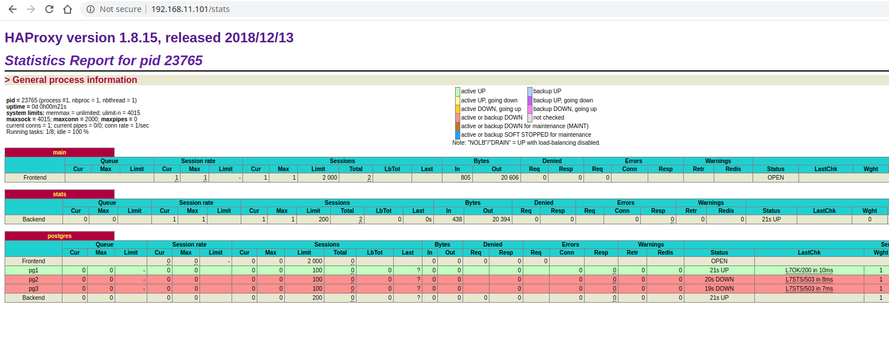

# PostgreSQL cluster 

## Домашнее задание

Разворачиваем кластер Patroni
Цель: - Развернуть кластер PostgreSQL из трех нод. Создать тестовую базу - проверить статус репликации - Сделать switchover/failover - Поменять конфигурацию PostgreSQL + с параметром требующим перезагрузки - Настроить клиентские подключения через HAProxy

## Выполнение

За основу взять стенд <https://gitlab.com/otus_linux/patroni>, изменена ОС на CentOS 8, ибо уже пора на ней тестировать все. Изменены и дополнены роли.

1. Поднимаем vagrant:

```bash
vagrant up
```

2. Запускаем playbook:

```bash
ansible-playbook site.yml -vvv
```

3. Для начала проверим работу haproxy, а заодно и check patroni - перейдем в браузере по ссылке <http://192.168.11.101/stats> и видим:



4. Проверять будем host pg1 и pg2, с pg3 ситуация будет аналогичная. Для начала проверим статус кластера:

[postgres@pg1 ~]$ patronictl -c /etc/patroni/patroni.yml list
+------------+--------+----------------+--------+---------+----+-----------+
|  Cluster   | Member |      Host      |  Role  |  State  | TL | Lag in MB |
+------------+--------+----------------+--------+---------+----+-----------+
| My_patroni |  pg1   | 192.168.11.120 | Leader | running |  1 |           |
| My_patroni |  pg2   | 192.168.11.121 |        | running |  1 |         0 |
| My_patroni |  pg3   | 192.168.11.122 |        | running |  1 |         0 |
+------------+--------+----------------+--------+---------+----+-----------+

5. Проверим репликацию, создадим тестовую базу. Пока чисто:

```bash
[postgres@pg1 ~]$ psql -h 192.168.11.120
Password for user postgres: 
psql (11.7)
Type "help" for help.

postgres=# \l+
                                                                    List of databases
   Name    |  Owner   | Encoding |   Collate   |    Ctype    |   Access privileges   |  Size   | Tablespace |                Description                 
-----------+----------+----------+-------------+-------------+-----------------------+---------+------------+--------------------------------------------
 postgres  | postgres | UTF8     | en_US.UTF-8 | en_US.UTF-8 |                       | 7725 kB | pg_default | default administrative connection database
 template0 | postgres | UTF8     | en_US.UTF-8 | en_US.UTF-8 | =c/postgres          +| 7585 kB | pg_default | unmodifiable empty database
           |          |          |             |             | postgres=CTc/postgres |         |            | 
 template1 | postgres | UTF8     | en_US.UTF-8 | en_US.UTF-8 | =c/postgres          +| 7585 kB | pg_default | default template for new databases
           |          |          |             |             | postgres=CTc/postgres |         |            | 
(3 rows)
```

```bash
[postgres@pg2 ~]$ psql -h 192.168.11.121
Password for user postgres: 
psql (11.7)
Type "help" for help.

postgres=# \l+
                                                                    List of databases
   Name    |  Owner   | Encoding |   Collate   |    Ctype    |   Access privileges   |  Size   | Tablespace |                Description                 
-----------+----------+----------+-------------+-------------+-----------------------+---------+------------+--------------------------------------------
 postgres  | postgres | UTF8     | en_US.UTF-8 | en_US.UTF-8 |                       | 7725 kB | pg_default | default administrative connection database
 template0 | postgres | UTF8     | en_US.UTF-8 | en_US.UTF-8 | =c/postgres          +| 7585 kB | pg_default | unmodifiable empty database
           |          |          |             |             | postgres=CTc/postgres |         |            | 
 template1 | postgres | UTF8     | en_US.UTF-8 | en_US.UTF-8 | =c/postgres          +| 7585 kB | pg_default | default template for new databases
           |          |          |             |             | postgres=CTc/postgres |         |            | 
(3 rows)
```

Создаем базу на pg1:

```
postgres=# CREATE DATABASE cluster_test OWNER postgres;
CREATE DATABASE
postgres=# \l+
                                                                     List of databases
     Name     |  Owner   | Encoding |   Collate   |    Ctype    |   Access privileges   |  Size   | Tablespace |                Description                 
--------------+----------+----------+-------------+-------------+-----------------------+---------+------------+--------------------------------------------
 cluster_test | postgres | UTF8     | en_US.UTF-8 | en_US.UTF-8 |                       | 7585 kB | pg_default | 
 postgres     | postgres | UTF8     | en_US.UTF-8 | en_US.UTF-8 |                       | 7725 kB | pg_default | default administrative connection database
 template0    | postgres | UTF8     | en_US.UTF-8 | en_US.UTF-8 | =c/postgres          +| 7585 kB | pg_default | unmodifiable empty database
              |          |          |             |             | postgres=CTc/postgres |         |            | 
 template1    | postgres | UTF8     | en_US.UTF-8 | en_US.UTF-8 | =c/postgres          +| 7585 kB | pg_default | default template for new databases
              |          |          |             |             | postgres=CTc/postgres |         |            | 
(4 rows)
```

На pg2 видим что она среплицировалась:

```bash
postgres=# \l+
                                                                     List of databases
     Name     |  Owner   | Encoding |   Collate   |    Ctype    |   Access privileges   |  Size   | Tablespace |                Description                 
--------------+----------+----------+-------------+-------------+-----------------------+---------+------------+--------------------------------------------
 cluster_test | postgres | UTF8     | en_US.UTF-8 | en_US.UTF-8 |                       | 7585 kB | pg_default | 
 postgres     | postgres | UTF8     | en_US.UTF-8 | en_US.UTF-8 |                       | 7725 kB | pg_default | default administrative connection database
 template0    | postgres | UTF8     | en_US.UTF-8 | en_US.UTF-8 | =c/postgres          +| 7585 kB | pg_default | unmodifiable empty database
              |          |          |             |             | postgres=CTc/postgres |         |            | 
 template1    | postgres | UTF8     | en_US.UTF-8 | en_US.UTF-8 | =c/postgres          +| 7585 kB | pg_default | default template for new databases
              |          |          |             |             | postgres=CTc/postgres |         |            | 
(4 rows)
```

6. Проверка switchover

Кладем patroni на pg1 - *systemctl stop patroni* и на pg2 что мастер нодой стала pg3:

```bash
[postgres@pg2 ~]$ patronictl -c /etc/patroni/patroni.yml list
+------------+--------+----------------+--------+---------+----+-----------+
|  Cluster   | Member |      Host      |  Role  |  State  | TL | Lag in MB |
+------------+--------+----------------+--------+---------+----+-----------+
| My_patroni |  pg1   | 192.168.11.120 |        | stopped |    |   unknown |
| My_patroni |  pg2   | 192.168.11.121 |        | running |  2 |         0 |
| My_patroni |  pg3   | 192.168.11.122 | Leader | running |  2 |           |
+------------+--------+----------------+--------+---------+----+-----------+
```

7. Проверка failover

На pg3 выполняем:

```bash
[postgres@pg3 ~]$ patronictl -c /etc/patroni/patroni.yml failover
Candidate ['pg1', 'pg2'] []: pg2
Current cluster topology
+------------+--------+----------------+--------+---------+----+-----------+
|  Cluster   | Member |      Host      |  Role  |  State  | TL | Lag in MB |
+------------+--------+----------------+--------+---------+----+-----------+
| My_patroni |  pg1   | 192.168.11.120 |        | running |  2 |         0 |
| My_patroni |  pg2   | 192.168.11.121 |        | running |  2 |         0 |
| My_patroni |  pg3   | 192.168.11.122 | Leader | running |  2 |           |
+------------+--------+----------------+--------+---------+----+-----------+
Are you sure you want to failover cluster My_patroni, demoting current master pg3? [y/N]: y
2020-04-13 20:46:25.23263 Successfully failed over to "pg2"
+------------+--------+----------------+--------+---------+----+-----------+
|  Cluster   | Member |      Host      |  Role  |  State  | TL | Lag in MB |
+------------+--------+----------------+--------+---------+----+-----------+
| My_patroni |  pg1   | 192.168.11.120 |        | running |  2 |         0 |
| My_patroni |  pg2   | 192.168.11.121 | Leader | running |  2 |           |
| My_patroni |  pg3   | 192.168.11.122 |        | stopped |    |   unknown |
+------------+--------+----------------+--------+---------+----+-----------+
```

Смотрим на pg1:

```
[postgres@pg1 ~]$ patronictl -c /etc/patroni/patroni.yml list
+------------+--------+----------------+--------+---------+----+-----------+
|  Cluster   | Member |      Host      |  Role  |  State  | TL | Lag in MB |
+------------+--------+----------------+--------+---------+----+-----------+
| My_patroni |  pg1   | 192.168.11.120 |        | running |  3 |         0 |
| My_patroni |  pg2   | 192.168.11.121 | Leader | running |  3 |           |
| My_patroni |  pg3   | 192.168.11.122 |        | running |  3 |         0 |
```

8. Изменяем конфиги

```bash
[postgres@pg2 ~]$ patronictl -c /etc/patroni/patroni.yml edit-config
--- 
+++ 
@@ -7,7 +7,7 @@
       archive-push -B /var/backup --instance dbdc2 --wal-file-path=%p --wal-file-name=%f
       --remote-host=10.23.1.185
     archive_mode: 'on'
-    max_connections: 100
+    max_connections: 50
     max_parallel_workers: 8
     max_wal_senders: 5
     max_wal_size: 2GB

Apply these changes? [y/N]: y
Configuration changed
```

После чего делаем поочередно тоже самое на остальных нодах кластера и перезапускаем командой:

```
patronictl -c /etc/patroni/patroni.yml restart My_patroni pg{1,2,3}
```
