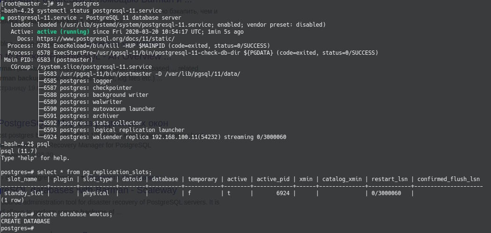
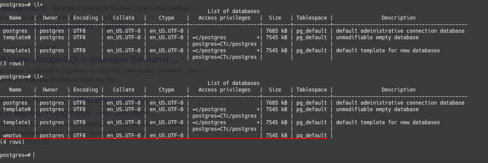

# PostgreSQL

## Домашнее задание

PostgreSQL

- Настроить hot_standby репликацию с использованием слотов
- Настроить правильное резервное копирование

Для сдачи работы присылаем ссылку на репозиторий, в котором должны обязательно быть Vagranfile и плейбук Ansible, конфигурационные файлы postgresql.conf, pg_hba.conf и recovery.conf, а так же конфиг barman, либо скрипт резервного копирования. Команда "vagrant up" должна поднимать машины с настроенной репликацией и резервным копированием. Рекомендуется в README.md файл вложить результаты (текст или скриншоты) проверки работы репликации и резервного копирования.

## Выполнение дз

1. Поднимаем vagrant

```bash
vagrant up
```

2. Запускаем playbook

```bash
ansible-playbook provision.yml -v # здесь нужный для вас verbose
```

3. При желании, можно создать на **master** базу/таблицу и увидеть на **slave** что репликация проходит. Или довериться скринам:

- Master


- Slave


4. Для проверки бакупа, заходим на **backup**, логинимся под пользователем barman :

```bash
-bash-4.2$ barman check backup
Server backup:
        WAL archive: FAILED (please make sure WAL shipping is setup)
        PostgreSQL: OK
        is_superuser: OK
        PostgreSQL streaming: OK
        wal_level: OK
        replication slot: OK
        directories: OK
        retention policy settings: OK
        backup maximum age: OK (no last_backup_maximum_age provided)
        compression settings: OK
        failed backups: OK (there are 0 failed backups)
        minimum redundancy requirements: OK (have 0 backups, expected at least 0)
        pg_basebackup: OK
        pg_basebackup compatible: OK
        pg_basebackup supports tablespaces mapping: OK
        systemid coherence: OK (no system Id stored on disk)
        pg_receivexlog: OK
        pg_receivexlog compatible: OK
        receive-wal running: OK
        archiver errors: OK
-bash-4.2$ barman switch-wal --archive backup
The WAL file 000000010000000000000003 has been closed on server 'backup'
Waiting for the WAL file 000000010000000000000003 from server 'backup' (max: 30 seconds)
Processing xlog segments from streaming for backup
        000000010000000000000003
-bash-4.2$ barman backup backup --wait
Starting backup using postgres method for server backup in /var/lib/barman/backup/base/20200321T064145
Backup start at LSN: 0/4000140 (000000010000000000000004, 00000140)
Starting backup copy via pg_basebackup for 20200321T064145
Copy done (time: 1 second)
Finalising the backup.
This is the first backup for server backup
WAL segments preceding the current backup have been found:
        000000010000000000000003 from server backup has been removed
Backup size: 22.6 MiB
Backup end at LSN: 0/6000000 (000000010000000000000005, 00000000)
Backup completed (start time: 2020-03-21 06:41:45.426942, elapsed time: 1 second)
Waiting for the WAL file 000000010000000000000005 from server 'backup'
Processing xlog segments from streaming for backup
        000000010000000000000004
Processing xlog segments from streaming for backup
        000000010000000000000005
-bash-4.2$ barman check backup
Server backup:
        PostgreSQL: OK
        is_superuser: OK
        PostgreSQL streaming: OK
        wal_level: OK
        replication slot: OK
        directories: OK
        retention policy settings: OK
        backup maximum age: OK (no last_backup_maximum_age provided)
        compression settings: OK
        failed backups: OK (there are 0 failed backups)
        minimum redundancy requirements: OK (have 1 backups, expected at least 0)
        pg_basebackup: OK
        pg_basebackup compatible: OK
        pg_basebackup supports tablespaces mapping: OK
        systemid coherence: OK
        pg_receivexlog: OK
        pg_receivexlog compatible: OK
        receive-wal running: OK
        archiver errors: OK
```
